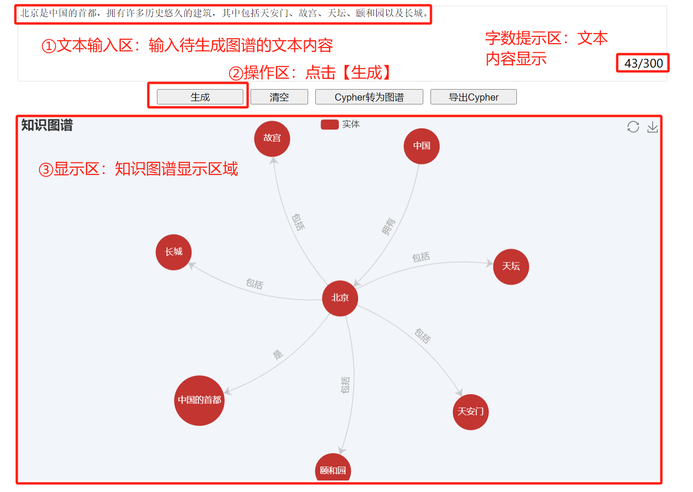
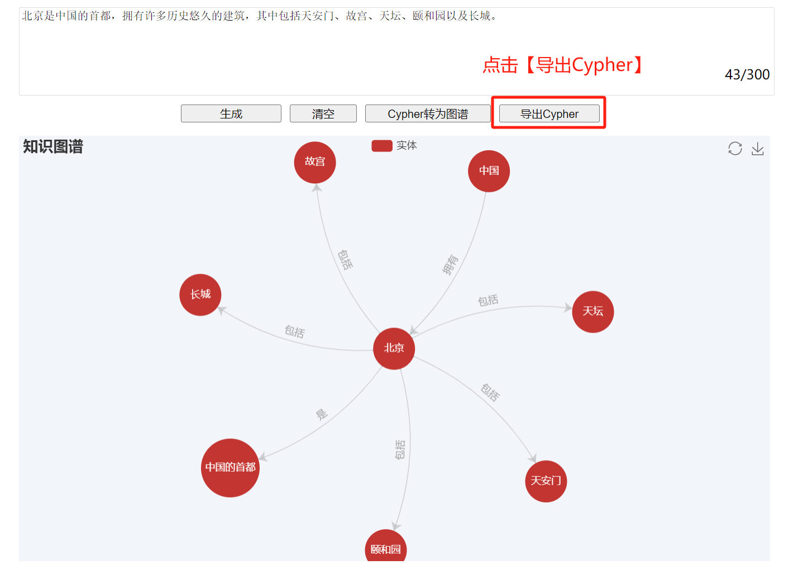
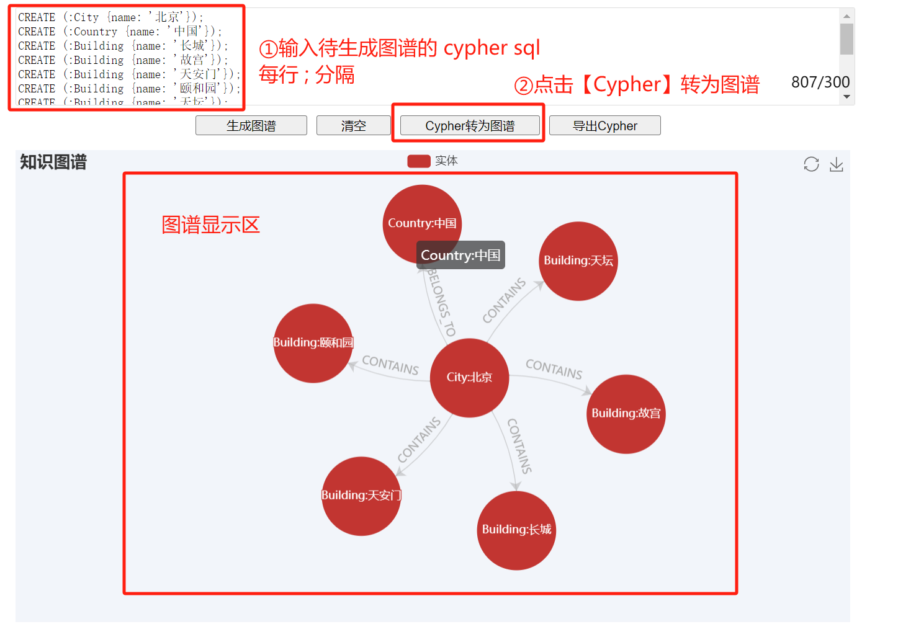

# 项目介绍
## 项目名称
AI知识图谱
## 项目描述
通过AI大模型的分析和推理能力，我们能够将分散的知识点整合成一个有机的知识网络，以展示知识之间的关系和连接。这种可视化的知识图谱不仅能够帮助用户更直观地探索和理解知识结构，还能够提供更深入的洞察和发现。

同时，通过简单使用Cypher SQL语法，让大家对图数据库有初步的了解，从而体验到图数据库的强大功能和灵活性。
## 项目地址
http://www.ai-knowledge-graph.top

# 本地如何运行
## build
```
mvn clean package
```

## run
```
java -Dloader.path=target/lib -jar target/ai-knowledge-graph-0.0.1-SNAPSHOT.jar
```

## 访问
```
http://localhost:80
```

# 使用帮助
## 1. 输入文本，根据文本内容生成知识图谱

Example:
```
北京是中国的首都，拥有许多历史悠久的建筑，其中包括天安门、故宫、天坛、颐和园以及长城。
```
** IMPORTANT **
- 文本内容字数上限为 300
- 每个用户每日最多可体验调用AI生成知识图谱为3次
- 生成的知识图图谱由 AI 生成，可能存在一定的误差，仅供参考，用户可根据自身需求进行二次编辑
## 2. 将知识图谱导出为 cypher sql

## 3. 输入 cypher sql，生成知识图谱

Example:
```
CREATE (:City {name: '北京'});
CREATE (:Country {name: '中国'});
CREATE (:Building {name: '长城'});
CREATE (:Building {name: '故宫'});
CREATE (:Building {name: '天安门'});
CREATE (:Building {name: '颐和园'});
CREATE (:Building {name: '天坛'});
MATCH (s:City), (t:Country) WHERE s.name = '北京' and t.name = '中国' CREATE (s)-[:BELONGS_TO]->(t);
MATCH (s:City), (t:Building) WHERE s.name = '北京' and t.name = '长城' CREATE (s)-[:CONTAINS]->(t);
MATCH (s:City), (t:Building) WHERE s.name = '北京' and t.name = '故宫' CREATE (s)-[:CONTAINS]->(t);
MATCH (s:City), (t:Building) WHERE s.name = '北京' and t.name = '天安门' CREATE (s)-[:CONTAINS]->(t);
MATCH (s:City), (t:Building) WHERE s.name = '北京' and t.name = '颐和园' CREATE (s)-[:CONTAINS]->(t);
MATCH (s:City), (t:Building) WHERE s.name = '北京' and t.name = '天坛' CREATE (s)-[:CONTAINS]->(t);
```
** IMPORTANT **
- 每行 cypher sql，使用封号(;)进行分隔
- 目前只支持 Create Entity 和 Create Relation 两种操作
- Entity 和 Relation 必须包含 name，以及使用 name 进行关联

# 建议与反馈
如果有任何问题或建议，欢迎加入群聊
